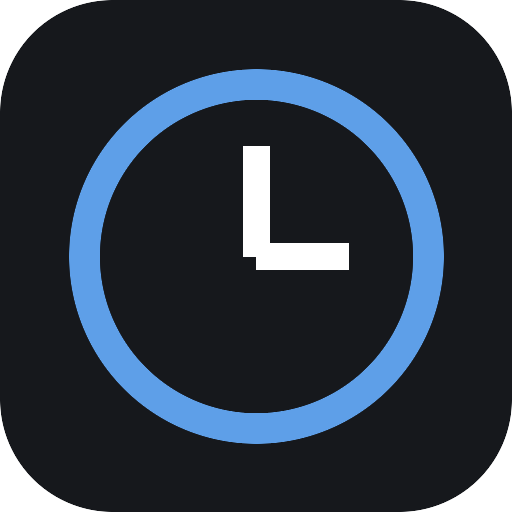
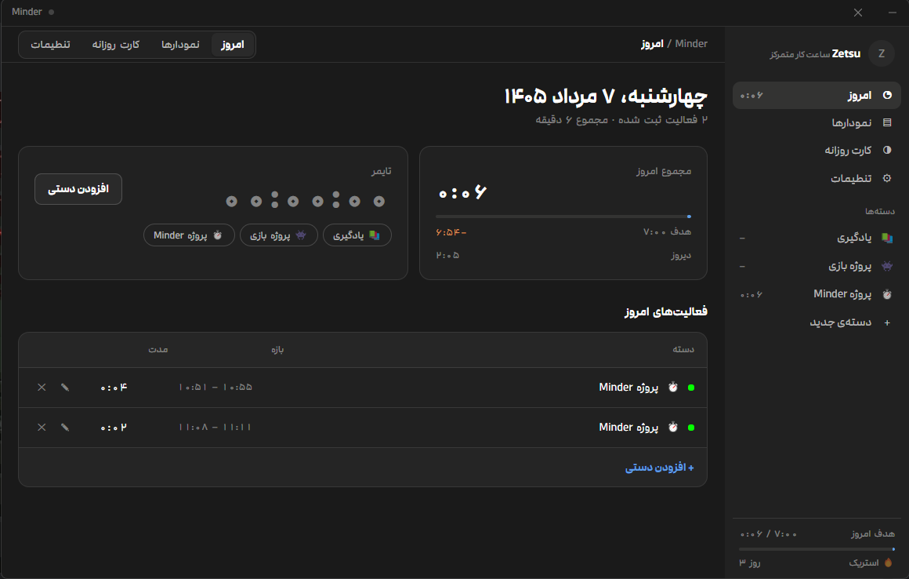
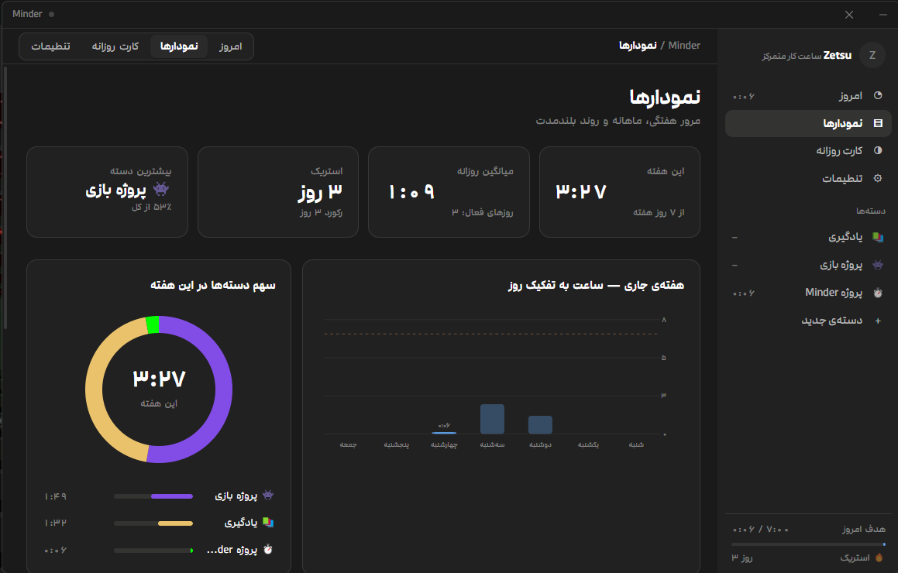
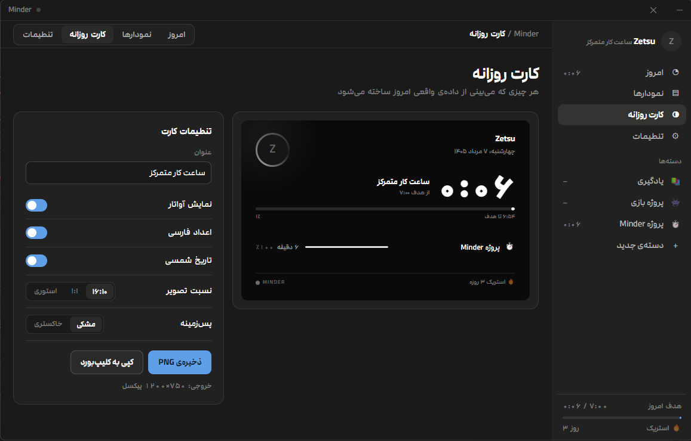
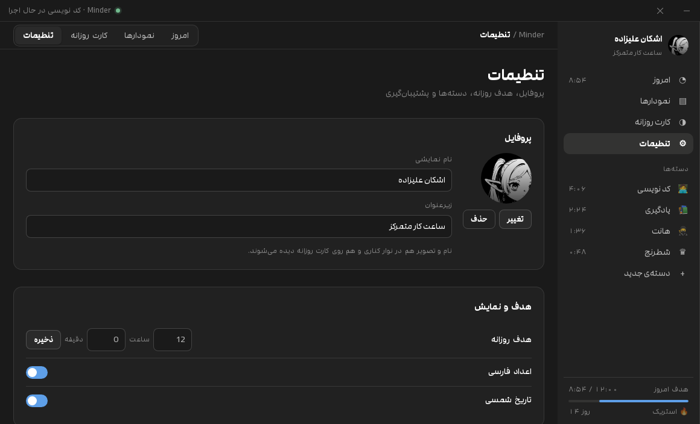

<div align="center">



# Minder

**ثبت ساعت کار متمرکز برای ویندوز — کاملاً آفلاین، بدون حساب کاربری، بدون تلمتری**

[](LICENSE)
[](#نصب-و-اجرا)
[](https://www.electronjs.org/)
[](package.json)

</div>

---

<div dir="rtl">

برنامه‌ی دسکتاپ ساده‌ای برای اینکه بدانی واقعاً روزت را چطور گذرانده‌ای. تایمر را روی یک دسته روشن می‌کنی، و در پایان روز یک کارت تصویری تمیز برای خودت یا برای اشتراک‌گذاری داری.

**همه‌ی داده‌ها روی کامپیوتر خودت می‌ماند.** نه سروری، نه حسابی، نه درخواست شبکه‌ای. می‌توانی اینترنت را قطع کنی و برنامه مو به مو همان کاری را بکند که می‌کرد.

</div>

## نگاهی به برنامه

### امروز — تایمر و رکوردهای روز



<div dir="rtl">

تایمر زنده، مجموع روز در مقایسه با هدف، مقایسه با دیروز، و جدول رکوردهای قابل ویرایش. هر رکورد را می‌توانی دستی هم اضافه کنی — اگر یادت رفت تایمر را بزنی.

</div>

### نمودارها — روند هفتگی، ماهانه و سالانه



<div dir="rtl">

نمودار ستونی هفته، دوناتِ سهم دسته‌ها، ماهانه، نقشه‌ی حرارتی سال، به‌همراه میانگین روزانه و استریک. همه‌ی نمودارها SVG دست‌نوشته‌اند — هیچ کتابخانه‌ی نموداری در پروژه نیست.

</div>

### کارت روزانه — خروجی PNG



<div dir="rtl">

کارت خروجی روز را با تاریخ شمسی، مجموع ساعت، نوار پیشرفت هر دسته و استریک می‌سازد. سه نسبت تصویر (۱۶:۱۰ ، ۱:۱ ، استوری ۹:۱۶)، دو پس‌زمینه، خروجی با ذخیره‌ی فایل یا کپی مستقیم در کلیپ‌بورد.

</div>

### تنظیمات — پروفایل، هدف، دسته‌ها و پشتیبان‌گیری



<div dir="rtl">

نام نمایشی و آواتار، هدف روزانه، ارقام فارسی، تقویم شمسی، مدیریت دسته‌ها (ایموجی و رنگ)، و برون‌ریزی / بازیابی کامل داده‌ها.

</div>

## ویژگی‌ها

<div dir="rtl">

| | |
| --- | --- |
| 🕒 **دو روش ثبت** | تایمر زنده یا ورود دستی بازه‌ی زمانی |
| 📂 **دسته‌بندی** | دسته‌ی دلخواه با ایموجی و رنگ اختصاصی |
| 📈 **تحلیل** | هفتگی، ماهانه، نقشه‌ی حرارتی سالانه، استریک |
| 🖼 **کارت خروجی** | PNG تا ۱۰۸۰×۱۹۲۰ برای استوری و پست |
| 📅 **تقویم شمسی** | تبدیل تاریخ درون‌ساخت، بدون کتابخانه‌ی خارجی |
| 🔒 **حریم خصوصی** | صفر درخواست شبکه، صفر تلمتری |
| 🪶 **سبک** | بدون وابستگی زمان اجرا، بدون مادول بومی، بدون نیاز به کمپایلر |
| 🖋 **فونت مدام** | هشت وزن باندل‌شده، رابط کاربری کاملاً راست‌به‌چپ |

</div>

## نصب و اجرا

### کاربر عادی

<div dir="rtl">

از بخش [Releases](../../releases) فایل `Minder-win-x64.zip` را بگیر، هر جا خواستی اکسترکت کن و `Minder.exe` را اجرا کن. نصب لازم نیست.

> ویندوز به برنامه‌های امضانشده هشدار SmartScreen می‌دهد. روی **More info → Run anyway** بزن.

</div>

### توسعه‌دهنده

```bash
git clone https://github.com/zet4u/Minder.git
cd Minder
npm install
npm start
```

<div dir="rtl">

اگر `npm install` نتوانست باینری الکترون را دانلود کند (شبکه‌ی محدود یا فیلترینگ)، زیپ الکترون را دستی از [releases الکترون](https://github.com/electron/electron/releases/tag/v31.4.0) بگیر و از اسکریپت آماده استفاده کن — همه‌ی کار را خودکار انجام می‌دهد:

</div>

```powershell
powershell -ExecutionPolicy Bypass -File .\setup.ps1 -ElectronZip "D:\Downloads\electron-v31.4.0-win32-x64.zip"
```

### ساخت خروجی ویندوز

<div dir="rtl">

**روش آفلاین (توصیه‌شده)** — از الکترون موجود استفاده می‌کند و چیزی دانلود نمی‌کند:

</div>

```powershell
powershell -ExecutionPolicy Bypass -File .\build-exe.ps1 -Zip
```

<div dir="rtl">

خروجی: `dist\Minder\Minder.exe` پرتابل به‌همراه `dist\Minder-win-x64.zip`.

**نسخه‌ی نصب‌کننده (NSIS)** — به اینترنت آزاد نیاز دارد:

</div>

```bash
npm run dist
```

## داده‌های تو کجا ذخیره می‌شوند

```
%APPDATA%\Minder\minder.json          داده‌ها (با پشتیبان خودکار minder.json.bak)
%APPDATA%\Minder\profile\avatar-*     تصویر پروفایل
%APPDATA%\Minder\renderer.log         لاگ خطاها
```

<div dir="rtl">

یک فایل JSON خوانای انسان، با نوشتن اتمیک (`.tmp` و سپس rename) و بازیابی خودکار از پشتیبان در صورت خرابی.
هیچ داده‌ای داخل پوشه‌ی پروژه نوشته نمی‌شود — یعنی کلون کردن یا پوش کردن مخزن هیچ اطلاعات شخصی‌ای را جابه‌جا نمی‌کند.

</div>

## ساختار پروژه

```
src/main/main.js         پروسه‌ی اصلی، پنجره، کانال‌های IPC، رندر PNG کارت
src/main/db.js           ذخیره‌ساز JSON اتمیک با پشتیبان و بازیابی
src/main/preload.js      پل امن contextBridge به رابط کاربری
src/renderer/app.js      منطق و رندر رابط کاربری
src/renderer/jalali.js   تبدیل تقویم شمسی
src/renderer/card.js     ساخت SVG کارت روزانه
src/renderer/charts.js   نمودارهای SVG
assets/fonts/            فونت مدام (۸ وزن)
setup.ps1                نصب دستی الکترون از زیپ محلی
build-exe.ps1            ساخت خروجی پرتابل به‌صورت آفلاین
```

## مشارکت

<div dir="rtl">

Issue و Pull Request خوش‌آمد است. دو قاعده‌ی مهم پروژه:

1. **بدون وابستگی زمان اجرا.** نه پکیج npm در سمت رابط کاربری، نه مادول بومی. هر کسی باید بتواند بیلد بگیرد بدون Visual Studio یا Python.
2. **مراقب نام متغیرهای سراسری در `src/renderer` باش.** `contextBridge` ویژگی `window.api` را غیرقابل‌بازنویسی می‌سازد؛ اگر در سطح بالای اسکریپت `const api` تعریف کنی، کل فایل بدون هیچ پیام قابل‌دیدنی اجرا نمی‌شود و فقط یک پنجره‌ی خالی می‌بینی.

قبل از ارسال PR، برنامه را اجرا کن و مطمئن شو `%APPDATA%\Minder\renderer.log` خطایی ندارد.

</div>

## مجوز

<div dir="rtl">

کد تحت مجوز [MIT](LICENSE) منتشر شده. فونت مدام مجوز مستقل خودش را دارد.

</div>

---

## English

**Minder** is an offline focus-time tracker for Windows.

Start a timer on a category (or log a time range by hand), and Minder builds
your weekly, monthly and yearly picture from it — plus a shareable PNG summary
card for each day. The interface is right-to-left Persian with a built-in Jalali
calendar.

- Electron 31, **zero runtime dependencies**, no native modules, no compiler needed
- **Fully offline**: no accounts, no servers, no telemetry, no network requests at all
- All data in one human-readable JSON file under `%APPDATA%\Minder`, with atomic writes and automatic backup recovery
- Hand-written SVG charts and card renderer — no charting library
- Fixed 1160×740 frameless window

```bash
git clone https://github.com/zet4u/Minder.git && cd Minder
npm install && npm start
```

Prebuilt portable builds are on the [Releases](../../releases) page.
MIT licensed — the bundled Modam font keeps its own license.
