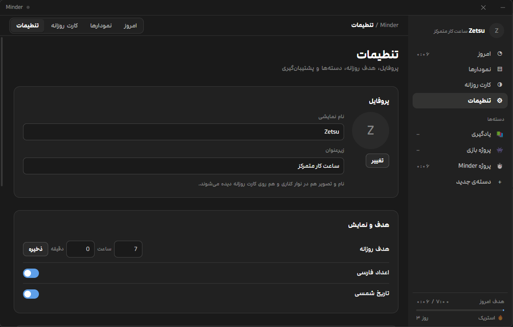

<div align="center">


# Minder

**می‌خواهی بدانی روزت را کجا گذاشتی؟ Minder دقیقاً همین کار را می‌کند.**

[](LICENSE)
[](#چطور-اجراش-کنم)
[](https://www.electronjs.org/)
[](package.json)

</div>

---

<div dir="rtl">

همه‌ی ما شب این جمله را گفته‌ایم: «یعنی امروز چیکار کردم پس؟»

Minder برای همین ساخته شد. تایمر را روی کاری که شروع کرده‌ای روشن می‌کنی، و آخر شب دقیقاً می‌دانی کدام ساعت‌ها کجا رفتند — با یک کارت تصویری تمیز که می‌توانی نگهش داری یا جایی بگذاریش.

نه حساب کاربری می‌خواهد، نه اینترنت، نه حتی یک درخواست شبکه‌ای. داده‌هایت در یک فایل روی کامپیوتر خودت می‌ماند و همانجا می‌ماند. می‌توانی کابل شبکه را بکشی و هیچ اتفاقی نمی‌افتد.

</div>

## چه شکلی است

### امروز


<div dir="rtl">

صفحه‌ای که بیشتر از همه باز می‌ماند. یک دسته را می‌زنی و تایمر می‌رود؛ بالا می‌بینی تا هدف امروز چقدر مانده و دیروز چطور بودی.

یادت رفت تایمر را بزنی؟ مشکلی نیست — بازه‌ی زمانی را دستی بزن یا هر رکورد را بعداً ویرایش کن.

</div>

### نمودارها


<div dir="rtl">

اینجا جایی است که الگوهایت را می‌بینی: کدام روزهای هفته واقعاً کار می‌کنی، وقتت بین دسته‌ها چطور تقسیم شده، ماه‌به‌ماه بهتر شده‌ای یا نه، و استریکت چند روز است.

همه‌ی این نمودارها دستی با SVG نوشته شده‌اند — هیچ کتابخانه‌ی نموداری در پروژه نیست.

</div>

### کارت روزانه


<div dir="rtl">

خروجی روزت در یک تصویر: تاریخ شمسی، مجموع ساعت، نوار هر دسته و استریک. سه نسبت دارد — مربع، عرضی و استوری — و می‌توانی یا فایل PNG ذخیره کنی یا مستقیم کپی کنی در کلیپ‌بورد.

هر عددی که روی کارت می‌بینی از داده‌ی واقعی همان روز ساخته می‌شود.

</div>

### تنظیمات



<div dir="rtl">

نام و تصویر خودت، هدف روزانه، دسته‌ها با ایموجی و رنگ دلخواه. ارقام فارسی و تقویم شمسی را هم می‌توانی خاموش کنی اگر ترجیح می‌دهی.

و مهم‌تر از همه: پشتیبان‌گیری و بازیابی کامل با یک فایل JSON — برای وقتی که ویندوز را عوض می‌کنی.

</div>

## چه کارهایی می‌کند

<div dir="rtl">

- ثبت با تایمر زنده، یا ورود دستی بازه‌ی زمانی برای وقتی که یادت رفت
- دسته‌ی دلخواه با ایموجی و رنگ خودت — کد نویسی، مطالعه، ورزش، هر چیزی
- نمودار هفتگی، ماهانه، نقشه‌ی حرارتی سالانه، میانگین روزانه و استریک
- کارت خروجی PNG تا ۱۰۸۰×۱۹۲۰ برای استوری و پست
- تقویم شمسی با تبدیل درون‌ساخت، بدون هیچ کتابخانه‌ی خارجی
- رابط کاربری کاملاً راست‌به‌چپ با فونت مدام در هشت وزن
- صفر درخواست شبکه، صفر تلمتری، صفر وابستگی زمان اجرا

</div>

## چطور اجراش کنم

### فقط می‌خواهم استفاده کنم

<div dir="rtl">

از [Releases](../../releases) فایل `Minder-win-x64.zip` را بگیر، هر جا خواستی اکسترکت کن، `Minder.exe` را بزن. همین. نصب لازم نیست و می‌توانی پوشه را روی فلش هم ببری.

> ویندوز به برنامه‌های امضانشده هشدار SmartScreen می‌دهد. روی **More info → Run anyway** بزن. این برای همه‌ی پروژه‌های اوپن‌سورس بدون گواهی امضا عادی است.

</div>

### می‌خواهم رویش کار کنم

```bash
git clone https://github.com/zet4u/Minder.git
cd Minder
npm install
npm start
```

<div dir="rtl">

اگر `npm install` سر دانلود الکترون گیر کرد (ایران، فیلترینگ، شبکه‌ی خراب — هر دلیلی)، خودت را ازیت نکن. زیپ را دستی از [releases الکترون](https://github.com/electron/electron/releases/tag/v31.4.0) بگیر و بقیه را بسپار به این اسکریپت:

</div>

```powershell
powershell -ExecutionPolicy Bypass -File .\setup.ps1 -ElectronZip "D:\Downloads\electron-v31.4.0-win32-x64.zip"
```

<div dir="rtl">

خودش اکسترکت می‌کند، مسیرها را مرتب می‌کند، سلامت فایل‌ها را چک می‌کند و برنامه را بالا می‌آورد.

</div>

### می‌خواهم خروجی exe بگیرم

<div dir="rtl">

راه آفلاین و بی‌دردسر — از الکترونی که همین حالا داری استفاده می‌کند و چیزی دانلود نمی‌کند:

</div>

```powershell
powershell -ExecutionPolicy Bypass -File .\build-exe.ps1 -Zip
```

<div dir="rtl">

نتیجه: `dist\Minder\Minder.exe` پرتابل به‌همراه `dist\Minder-win-x64.zip` برای پخش کردن.

اگر نصب‌کننده‌ی واقعی می‌خواهی (`Minder Setup.exe`) با `npm run dist` — ولی این یکی به اینترنت آزاد نیاز دارد.

</div>

## داده‌های من کجا می‌روند

```
%APPDATA%\Minder\minder.json          همه‌ی داده‌ها (+ minder.json.bak پشتیبان خودکار)
%APPDATA%\Minder\profile\avatar-*     تصویر پروفایل
%APPDATA%\Minder\renderer.log         لاگ خطاها برای وقتی که چیزی خراب شد
```

<div dir="rtl">

یک فایل JSON ساده و خوانا که خودت می‌توانی بازش کنی و بخوانیش. نوشتن اتمیک است (اول `.tmp` بعد جابه‌جایی)، پس اگر وسط ذخیره برق برود داده‌ات سالم می‌ماند؛ و اگر فایل خراب شود، خودکار از پشتیبان بازیابی می‌شود.

داخل پوشه‌ی پروژه هیچ داده‌ای نوشته نمی‌شود — پس کلون کردن، پوش کردن و فورک کردن مخزن به داده‌ی شخصی کسی کاری ندارد.

</div>

## چه خبر از درون

```
src/main/main.js         پروسه‌ی اصلی، پنجره، کانال‌های IPC، رندر PNG کارت
src/main/db.js           ذخیره‌ساز JSON با نوشتن اتمیک و بازیابی
src/main/preload.js      پل امن contextBridge به رابط کاربری
src/renderer/app.js      منطق و رندر رابط کاربری
src/renderer/jalali.js   تبدیل تقویم شمسی
src/renderer/card.js     ساخت SVG کارت روزانه
src/renderer/charts.js   نمودارهای SVG
assets/fonts/            فونت مدام (۸ وزن)
setup.ps1                نصب دستی الکترون از زیپ محلی
build-exe.ps1            ساخت خروجی پرتابل، کاملاً آفلاین
```

## می‌خواهم کمک کنم

<div dir="rtl">

خوشحال می‌شوم. Issue بزن، PR بفرست، یا فقط بگو چه چیزی آزارت می‌دهد. دو قاعده‌ی پروژه را فقط حواست باشد:

**۱. بدون وابستگی زمان اجرا.** نه پکیج npm در سمت رابط کاربری، نه مادول بومی. هر کسی باید بتواند بدون Visual Studio و Python بیلد بگیرد. این تصمیم از دل دردسر گرفتن با `better-sqlite3` درآمد — جدی بگیرش.

**۲. متغیر سراسری به نام `api` نساز.** `contextBridge` ویژگی `window.api` را غیرقابل‌بازنویسی می‌کند. اگر در سطح بالای یک اسکریپت `const api` تعریف کنی، کل فایل بی‌صدا اجرا نمی‌شود و فقط یک پنجره‌ی خالی می‌بینی — بدون هیچ پیام خطایی. یک ساعت از زندگی ما را گرفت؛ نگذار از مال تو هم بگیرد.

قبل از فرستادن PR، برنامه را اجرا کن و یک نگاه به `%APPDATA%\Minder\renderer.log` بینداز.

</div>

## مجوز

<div dir="rtl">

کد تحت [MIT](LICENSE) — بردار، عوض کن، بفروش، هر کاری خواستی بکن. فونت مدام مجوز مستقل خودش را دارد.

</div>

---

## English

**Minder** answers a question you have probably asked yourself at 2am:
*where did today actually go?*

Start a timer on whatever you are doing — or type the time range in later, if you
forgot — and Minder turns it into your weekly, monthly and yearly picture, plus a
shareable PNG card for each day. The interface is right-to-left Persian with a
built-in Jalali calendar.

It asks for no account and makes no network requests, ever. Everything lives in a
single readable JSON file under `%APPDATA%\Minder`, written atomically with
automatic backup recovery.

- Electron 31, **zero runtime dependencies**, no native modules, no compiler required
- Hand-written SVG charts and card renderer — no charting library
- Fixed 1160×740 frameless window

```bash
git clone https://github.com/zet4u/Minder.git && cd Minder
npm install && npm start
```

Prebuilt portable builds live on the [Releases](../../releases) page.
MIT licensed — the bundled Modam font keeps its own license.
